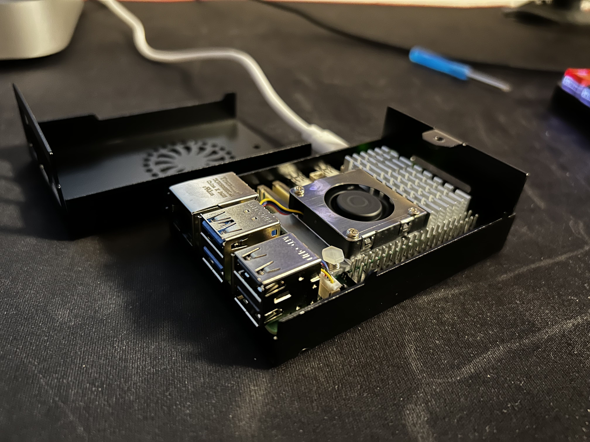

# Pi Cluster Homelab

The purpose of my homelab is to learn and to have fun. Being a Fullstack Developer by trade, I work with Kubernetes every day, and my homelab is the place where I can try out and learn new things. On the other hand, by self-hosting some applications, it makes me feel responsible for the entire process of deploying and maintaining an application from A to Z. It forces me to think about backup strategies, security, scalability and the ease of deployment and maintenance.

## Principles

- **GitOps First** — All cluster state is declared in this repository. Flux CD reconciles the desired state automatically.
- **Declarative Configuration** — No imperative scripts or manual `kubectl apply`. Everything is Kustomize manifests or Helm releases.
- **Secrets in Git** — Encrypted with SOPS + age, secrets live alongside the code they configure.
- **Automated Updates** — Renovate runs hourly to keep dependencies current via pull requests.
- **Single Source of Truth** — This repo is the canonical source for what runs in the cluster.

## Hardware

| Node | Role | Hardware | RAM | Storage | OS |
|------|------|----------|-----|---------|-----|
| tony | Control Plane | Raspberry Pi 5 | 8GB | 128GB microSD | Ubuntu 24.04.3 LTS |



## Cluster Provisioning

The cluster runs [k3s](https://k3s.io/) — a lightweight Kubernetes distribution perfect for edge and IoT deployments.

**K3s version:** v1.34.3+k3s1

**Built-in components:**
- Traefik (Ingress Controller)
- CoreDNS
- Metrics Server
- Local Path Provisioner (default StorageClass)

### Bootstrapping Flux

After installing k3s, bootstrap Flux to enable GitOps:

```bash
flux bootstrap github \
  --owner=tonyspunei \
  --repository=pi-cluster \
  --branch=main \
  --path=clusters/staging \
  --personal
```

### SOPS Age Key

Secrets are encrypted with SOPS using age. The cluster needs the age private key to decrypt:

```bash
kubectl create secret generic sops-age \
  --namespace=flux-system \
  --from-file=age.agekey=/path/to/age.key
```

## Repository Structure

```
.
├── clusters/
│   └── staging/              # Flux entry point for staging cluster
│       └── flux-system/      # Flux controllers and GitRepository
├── apps/
│   ├── base/                 # Shared Kustomize bases for applications
│   │   ├── audiobookshelf/
│   │   ├── linkding/
│   │   └── handlesregister-db/
│   └── staging/              # Staging overlays (secrets, ingress, tunnels)
├── infrastructure/
│   └── controllers/          # Infrastructure components (Renovate)
├── monitoring/
│   ├── controllers/          # Prometheus stack Helm release
│   └── configs/              # Environment-specific monitoring configs
└── .sops.yaml                # SOPS encryption rules
```

## Environments

### Staging

The staging environment is the primary (and currently only) running environment. It's used for testing, experimentation, and self-hosting applications.

| Kustomization | Path | Interval | SOPS |
|---------------|------|----------|------|
| flux-system | `clusters/staging` | 10m | No |
| infrastructure | `infrastructure/controllers/staging` | 1m | Yes |
| apps | `apps/staging` | 1m | Yes |
| monitoring-controllers | `monitoring/controllers/staging` | 1m | No |
| monitoring-configs | `monitoring/configs/staging` | 1m | Yes |

### Production

Planned for the future when applications mature beyond experimentation.

## Applications

| Application | Description | Version | Access |
|-------------|-------------|---------|--------|
| [Audiobookshelf](https://www.audiobookshelf.org/) | Self-hosted audiobook and podcast server | 2.32.1 | Cloudflare Tunnel |
| [Linkding](https://github.com/sissbruecker/linkding) | Self-hosted bookmark manager | 1.45.0 | Traefik Ingress |
| [Grafana](https://grafana.com/) | Observability dashboards | (via kube-prometheus-stack) | Traefik Ingress |

### Audiobookshelf

Self-hosted audiobook and podcast server with apps for iOS and Android.

- **Namespace:** `audiobookshelf`
- **External URL:** `audiobooks.tonyspunei.dev` (Cloudflare Tunnel)
- **Storage:** 3 PVCs (config, metadata, audiobooks)

### Linkding

Minimal bookmark manager with tagging, search, and archiving.

- **Namespace:** `linkding`
- **External URL:** `lds.tonyspunei.dev` (Traefik Ingress with TLS)
- **Storage:** 1 PVC (SQLite database)

## Databases

| Database | Type | Namespace | Storage | Purpose |
|----------|------|-----------|---------|---------|
| MongoDB | Document Store | `handlesregister-db` | 10Gi PVC | Backend for handlesregister |
| SQLite | Embedded | `linkding` | 1Gi PVC | Linkding data |
| SQLite | Embedded | `audiobookshelf` | 1Gi PVC | Audiobookshelf metadata |

## Monitoring

The cluster runs the [kube-prometheus-stack](https://github.com/prometheus-community/helm-charts/tree/main/charts/kube-prometheus-stack) for full observability.

**Components:**
- Prometheus — Metrics collection and storage
- Grafana — Visualization and dashboards (`grafana.tonyspunei.dev`)
- Alertmanager — Alert routing and silencing
- Node Exporter — Host-level metrics
- Kube State Metrics — Kubernetes object metrics

**Helm Chart:** v81.2.2

## Networking

### Ingress

Traefik serves as the ingress controller (bundled with k3s).

| Host | Service | TLS |
|------|---------|-----|
| `lds.tonyspunei.dev` | linkding:9090 | Yes (SOPS secret) |
| `grafana.tonyspunei.dev` | grafana:80 | Yes (SOPS secret) |

### Cloudflare Tunnels

Some services are exposed via Cloudflare Tunnels for zero-trust access without opening ports.

| Tunnel | Hostname | Backend |
|--------|----------|---------|
| audiobooks | `audiobooks.tonyspunei.dev` | `http://audiobookshelf:3005` |

## Secrets Management

Secrets are encrypted using [SOPS](https://github.com/getsops/sops) with [age](https://github.com/FiloSottile/age) encryption.

**Workflow:**
1. Create a plain YAML secret
2. Encrypt with `sops --encrypt --in-place secret.yaml`
3. Commit the encrypted file to Git
4. Flux decrypts at reconciliation time using the `sops-age` secret

**Encrypted secrets in this repo:**
- Cloudflare tunnel credentials
- Database credentials (MongoDB)
- TLS certificates
- Application environment variables
- Renovate GitHub token

## Automation

### Renovate

[Renovate](https://docs.renovatebot.com/) runs as a CronJob every hour to automatically create PRs for dependency updates.

**Scope:**
- Container image tags
- Helm chart versions
- Kubernetes manifest updates

## Roadmap

- [ ] Public Homelab Dashboard
- [ ] Production environment
- [ ] Backup automation
- [ ] Additional self-hosted services

## Resources

- [Flux CD Documentation](https://fluxcd.io/docs/)
- [k3s Documentation](https://docs.k3s.io/)
- [SOPS](https://github.com/getsops/sops)
- [Kustomize](https://kustomize.io/)
